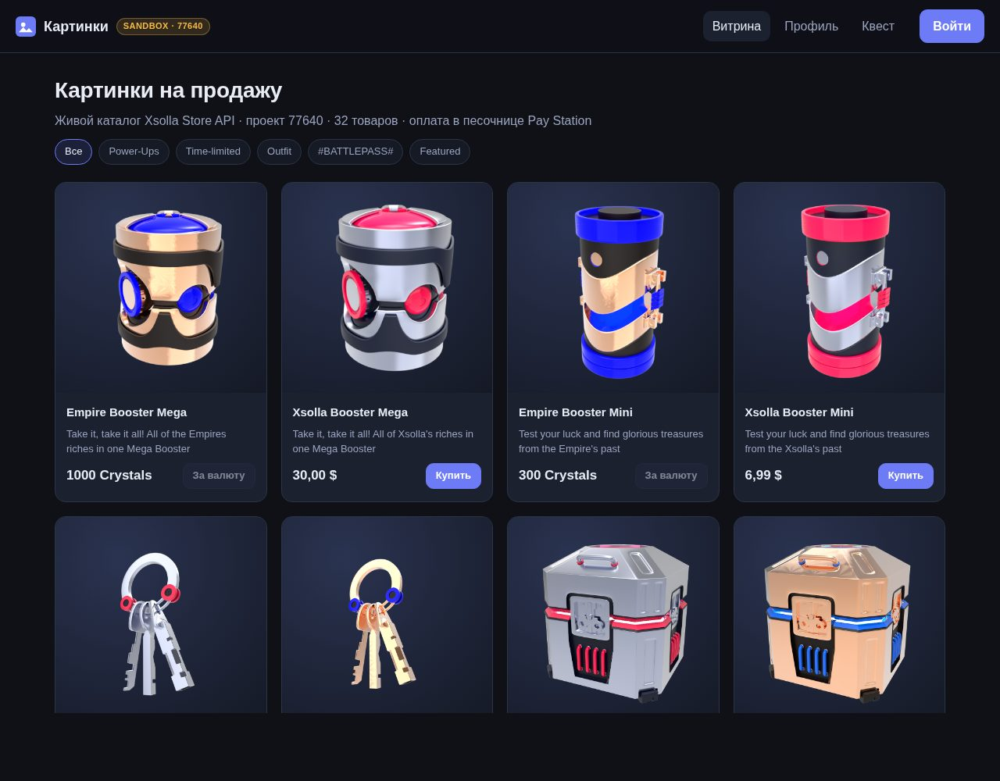
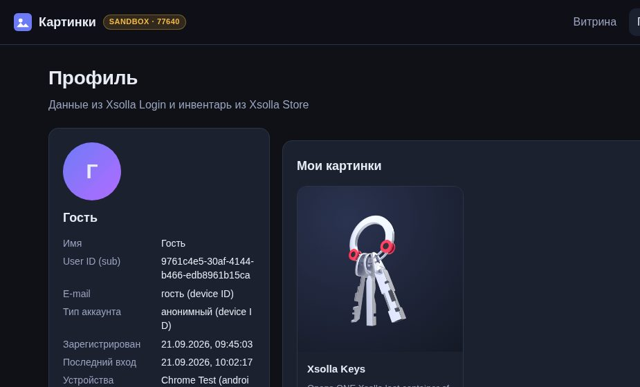
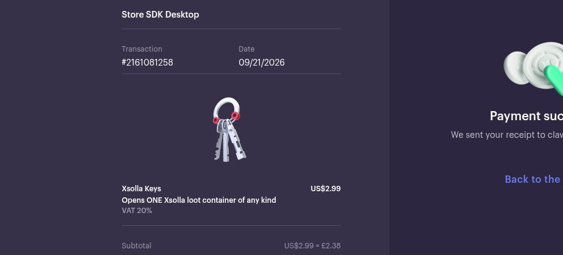

# Xsolla Image Store — демо-магазин картинок

Статический сайт (vanilla HTML/CSS/JS, без сборки), который продаёт «картинки» через Xsolla:
**Store API** (каталог, заказы, инвентарь), **Login** (OAuth 2.0, JWT) и **Pay Station** в
режиме **sandbox**. Работает прямо с GitHub Pages — сервера и секретов нет.

- Сайт: **https://rokk1stas1.github.io/xsolla-image-store/**
- Репозиторий: https://github.com/rokk1stas1/xsolla-image-store
- Анализ покрытия Xsolla AI Kit: [REPORT.md](REPORT.md)

| Витрина | Профиль с купленной картинкой | Pay Station sandbox |
|---|---|---|
|  |  |  |

**Проверено end-to-end 21.09.2026 (demo-профиль):** гостевой вход → заказ `key_1` (`POST /payment/item`, sandbox) →
оплата тестовой картой 4242… в Pay Station → заказ #735262705 `done` → `GET /user/inventory/items` вернул `key_1` →
картинка отображается в профиле.

## Что умеет

| # | Функция | Как реализовано |
|---|---------|-----------------|
| 1 | **Витрина** | `GET /api/v2/project/{id}/items/virtual_items` (публично, без авторизации) — картинка (`image_url`), название, цена, группы. Каталог подгружается живьём при каждом открытии. |
| 2 | **Логин / регистрация** | Xsolla Login, протокол OAuth 2.0 с публичным клиентом: `POST /oauth2/login/token` (логин + пароль), `POST /oauth2/user` (регистрация, подтверждение по e-mail), `POST /oauth2/login/device/android` → `POST /oauth2/token` (гостевой вход по device ID), `grant_type=refresh_token` — авто-обновление токена (access-токен живёт 5 мин). |
| 3 | **Профиль** | `GET https://login.xsolla.com/api/users/me` (Get user details) + claims JWT + `GET /user/inventory/items` (Bearer JWT) — купленные картинки. |
| 4 | **Покупка в sandbox** | `POST /payment/item/{sku}` с `sandbox: true` (Bearer JWT) → `token` → Pay Station во встроенном lightbox-виджете (`cdn.xsolla.net/embed/paystation/1.2.7/widget.min.js`, `sandbox: true`) → short-polling `GET /order/{order_id}` каждые 3 с до `done` → инвентарь обновляется. |
| 5 | **Таймеры «откроется через…»** | Список SKU и задержек в `config.js` (`timedUnlock`); отсчёт от первого визита, состояние в `localStorage`. Когда таймер истёк: если SKU бесплатный и пользователь вошёл — настоящая выдача `POST /free/item/{sku}`; иначе — картинка просто открывается. |
| 6 | **Квест «посмотри видео»** | YouTube IFrame Player API: событие `ENDED` или накопленное время просмотра ≥ `minWatchSeconds`. Награда — бесплатный SKU через `POST /free/item/{sku}` (если SKU бесплатный), иначе локальная разблокировка с пометкой в профиле. |

## Быстрый старт (локально)

```bash
git clone https://github.com/rokk1stas1/xsolla-image-store.git
cd xsolla-image-store
python3 -m http.server 8080      # или любой статический сервер
# открыть http://localhost:8080/
```

Сборка не нужна. Все пути относительные, поэтому сайт работает и на подпути GitHub Pages.

## Конфигурация — `config.js`

Единственный файл для настройки. Секретов в нём нет и быть не должно.

```js
activeProfile: 'demo',   // 'demo' | 'stas'
profiles: {
  demo: { projectId: 77640, login: { projectId: '026201e3-7e40-11ea-a85b-42010aa80004', clientId: 57 }, … },
  stas: { merchantId: 53105, projectId: 314739, login: { projectId: '', clientId: 0 }, … }
}
```

- **`demo`** (активен по умолчанию) — публичный демо-проект Xsolla из документации: Store 77640,
  Login `026201e3-7e40-11ea-a85b-42010aa80004`, OAuth 2.0-клиент 57. На нём весь сценарий
  логин → покупка → инвентарь работает end-to-end.
- **`stas`** — песочница проекта 314739 (Merchant 53105). Каталог, таймеры и **гостевая**
  покупка (проект разрешает анонимные заказы) работают уже сейчас, но логин и инвентарь
  требуют **Login ID** (UUID Login-проекта) и **ID публичного OAuth 2.0-клиента** — их можно
  взять в Publisher Account → *Players → Login → ваш Login-проект* (Login ID) и на вкладке
  *Security → OAuth 2.0* (client ID; у клиента должен быть разрешён callback
  `https://login.xsolla.com/api/blank` или свой URL — тогда поменяйте `redirectUri`).

Переключение проекта — одна строка `activeProfile: 'stas'`, либо без правки кода: добавить к URL
`?profile=stas` (например, https://rokk1stas1.github.io/xsolla-image-store/?profile=stas).

Другие параметры: `sandbox` (true), `locale` (`ru`), `payStationTheme` (`default_dark`),
`timedUnlock[]` и `quest` — на каждый профиль отдельно.

## Тестовая оплата в sandbox

В Pay Station (sandbox) используйте тестовые карты Xsolla
(https://developers.xsolla.com/dev-resources/testing/test-cards/):

| Карта | Срок | CVV | Результат |
|-------|------|-----|-----------|
| `4111 1111 1111 1111` (Visa) | `12/40` | любые 3 цифры | успех |
| `4242 4242 4242 4242` (Visa) | `12/40` | любые 3 цифры | успех |
| `5555 5555 5555 4444` (Mastercard) | `11/40` | любые 3 цифры | успех |

После успешной оплаты заказ проходит `new → paid → done`, сайт опрашивает `GET /order/{id}` и
картинка появляется в **Профиль → Мои картинки**.

## Структура

```
index.html            — оболочка SPA (hash-роутинг: #/, #/profile, #/quest)
config.js             — вся конфигурация (профили, SKU таймеров, квест)
css/style.css         — тёмная тема, адаптивная сетка
js/util.js            — выбор профиля, localStorage, helpers
js/xsolla.js          — клиент Store API v2 и Login API (OAuth 2.0)
js/auth.js            — сессия, refresh, модалка входа (логин / регистрация / гость)
js/unlock.js          — таймеры и выдача наград (free item или локально)
js/payment.js         — заказ → Pay Station widget → отслеживание заказа
js/views/store.js     — витрина
js/views/profile.js   — профиль и инвентарь
js/views/quest.js     — YouTube-квест
REPORT.md             — анализ покрытия Xsolla AI Kit
```

## Известные ограничения

1. **Login ID проекта 314739 неизвестен.** Получить его без Admin API нельзя, а Admin API
   (Basic-auth `project_id:api_key`) из нашей среды недоступен — см. REPORT.md. Поэтому
   активен демо-профиль. После ввода Login ID + client ID профиль `stas` заработает целиком.
2. **Pay Station вместо Headless Checkout.** Платёжный UI — стандартный Pay Station во
   встроенном виджете (sandbox). Полноценный Headless Checkout (`@xsolla/pay-station-sdk`:
   собственная форма карты, `form.init` + диспетчер `onNextAction`, 3DS return-page) — следующий
   шаг; токен для него уже получается тем же клиентским вызовом `POST /payment/item/{sku}`.
3. **Награды без бесплатного SKU выдаются локально.** В демо-проекте 77640 нет бесплатных
   товаров, поэтому квест и таймеры помечают награду в `localStorage`; в проекте 314739 есть
   `demofree_1`/`demofree_2` — там выдача идёт через Store API (`POST /free/item/{sku}`, при
   наличии Login ID). У бесплатных SKU действует лимит 1 шт./неделя на пользователя.
4. **Гостевой аккаунт** (device ID) привязан к браузеру; полный аккаунт требует подтверждения
   e-mail (письмо отправляет Xsolla Login).
5. **Социальный логин** не подключён: OAuth-redirect требует, чтобы URL сайта был в Callback URLs
   клиента Login-проекта (для демо-клиента 57 это недоступно).
6. **Нет серверной части** → нет вебхуков `order_paid`; подтверждение покупки — клиентский
   polling статуса заказа (рекомендованный Xsolla вариант «без сервера»).
7. Sandbox-платежи после первого реального платежа в проекте становятся доступны только
   сотрудникам компании из Publisher Account.
